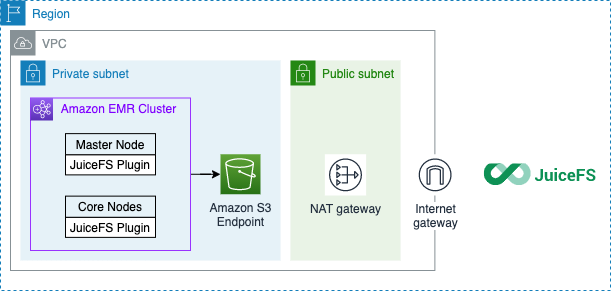
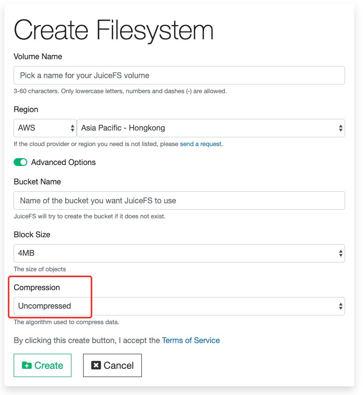
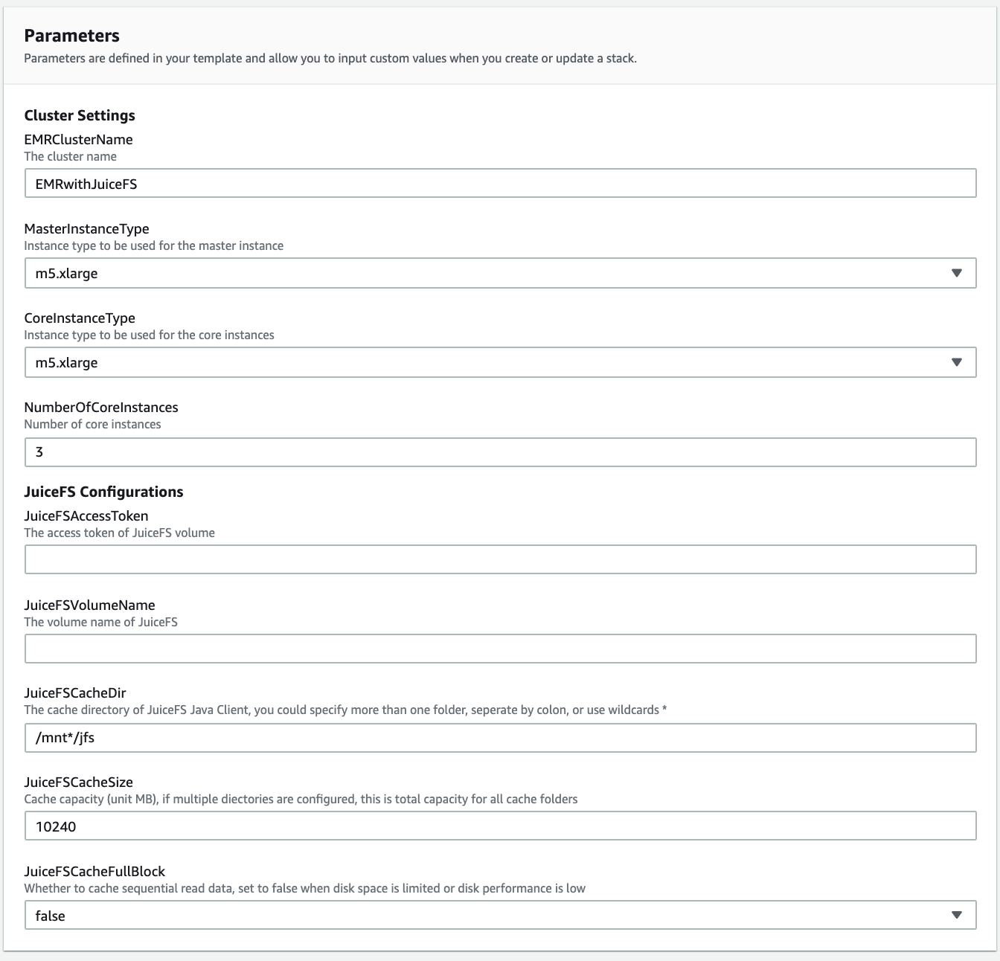
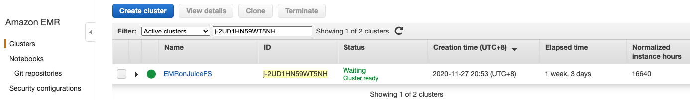
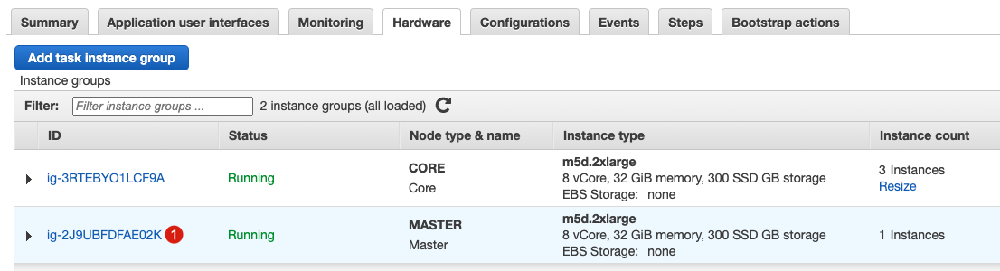
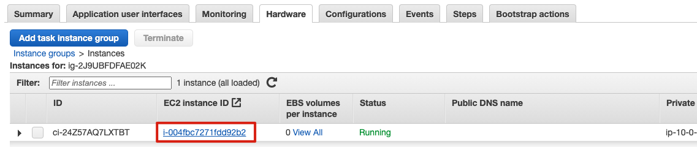
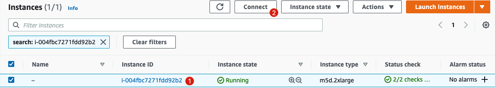
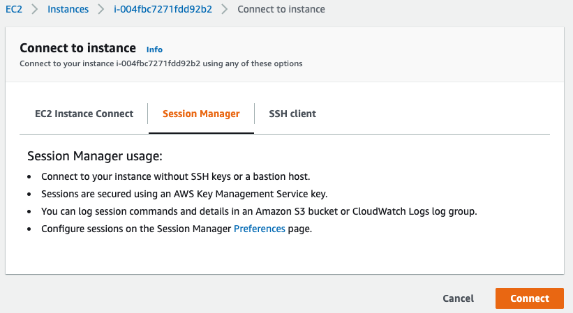
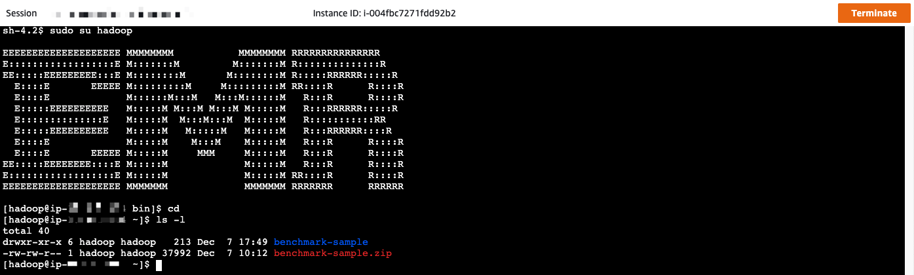
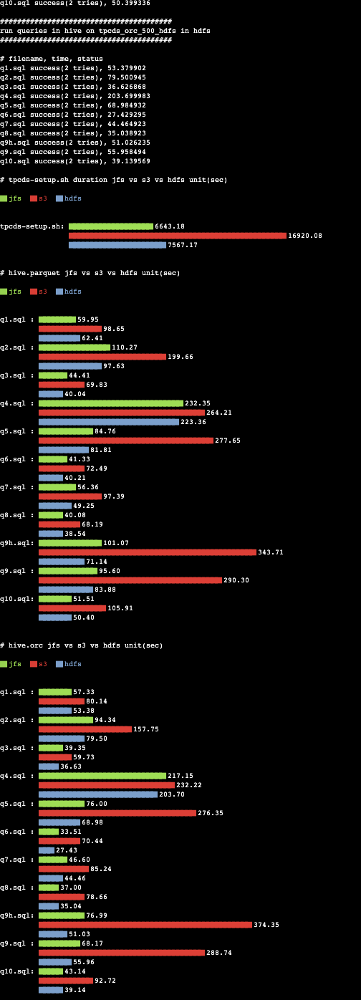

# Amazon EMR with JuiceFS QuickStart

[English](./README.md)

这是一个使用JuiceFS作为EMR集群存储后端的快速入门。[JuiceFS](https://juicefs.com/)是一个专门为在云端工作而设计的POSIX兼容的共享文件系统并且兼容HDFS。JuiceFS与自建的HDFS相比，可以节省50%~70%的成本，同时达到与自建HDFS同等的性能。

本方案还提供了一个TPC-DS的基准测试。在你的主节点主目录下有一个`benchmark-sample.zip`文件。在`hadoop`用户的主节点主目录下有一个`benchmark-sample.zip`文件。

TPC-DS 由事务性能管理委员会（TPC）发布，该委员会是目前最知名的数据管理系统评测基准标准化组织。TPC-DS 采用星型、雪花型等多维数据模式。它包含 7 张事实表，17 张纬度表，平均每张表含有 18 列。其工作负载包含 99 个 SQL 查询，覆盖 SQL99 和 2003 的核心部分以及 OLAP。这个测试集包含对大数据集的统计、报表生成、联机查询、数据挖掘等复杂应用，测试用的数据和值是有倾斜的，与真实数据一致。可以说 TPC-DS 是与真实场景非常接近的一个测试集，也是难度较大的一个测试集。

## 架构



> ⚠️注意
>
> 1. EMR 集群需要连接到 JuiceFS 元数据服务。它需要一个 NAT 网关来访问公共互联网
> 2. EMR 集群的每个节点都需要安装 JuiceFS Hadoop 扩展 JAR 包，才能使用 JuiceFS 作为存储后端
> 3. JuiceFS 只存储元数据，原始数据仍然存储在您的账户 S3 中

## 部署指南

### 先决条件

1. [注册JuiceFS账户](https://juicefs.com/accounts/register)

2. 在 JuiceFS 控制台上创建一个卷。选择你的 AWS 账户区域，并创建一个新卷。由于大数据里面常使用的是 ORC 或者 Parquet 文件格式，存在大量的随机读，为减少读放大，压缩格式改为 Uncompressed

    

3. 从 JuiceFS 控制台获取访问令牌和卷名。

    

### 启动您的堆栈

- 从 AWS 中国区域控制台中启动 [](https://console.amazonaws.cn/cloudformation/home#/stacks/quickcreate?templateUrl=https%3A%2F%2Faws-gcr-solutions.s3.cn-north-1.amazonaws.com.cn%2FAws-emr-with-juicefs-quickstart%2Flatest%2Femr-with-juicefs.template)
- 从 AWS 海外区域控制台中启动 [](https://console.aws.amazon.com/cloudformation/home#/stacks/quickcreate?templateUrl=https%3A%2F%2Faws-gcr-solutions.s3.amazonaws.com%2FAws-emr-with-juicefs-quickstart%2Flatest%2Femr-with-juicefs.template)

> ⚠️注意
>
> 请确保您已经登录了 AWS Console

启动参数

| 参数名                  	| 解释                                                                          	|
|-------------------------	|-------------------------------------------------------------------------------	|
| EMRClusterName          	| EMR 集群名称                                                                   	|
| MasterInstanceType      	| 主节点实例类型                                                                	|
| CoreInstanceType        	| 核心节点类型                                                                  	|
| NumberOfCoreInstances   	| 核心节点数量                                                                  	|
| JuiceFSAccessToken      	| JuiceFS 访问令牌                                                               	|
| JuiceFSVolumeName       	| JuiceFS 存储卷 Volume 名称                                                           	|
| JuiceFSCacheDir         	| 本地缓存目录，可以指定多个文件夹，用冒号 : 分隔，也可以使用通配符（比如 * ）  	|
| JuiceFSCacheSize        	| 磁盘缓存容量，单位 MB。如果配置多个目录，这是所有缓存目录的空间总和           	|
| JuiceFSCacheFullBlock   	| 是否缓存连续读数据，在磁盘空间有限或者磁盘性能低下的时候，设置为 false        	|

启动堆栈



一旦你完成了部署，你可以在EMR服务中检查你的集群。



进入硬件选项卡，找到你的主节点。




通过 AWS Systems Manager Session Manager 会话管理器连接到主节点。





验证集群环境

```shell
$ sudo su hadoop
## JFS_VOL 是一个预制的环境变量，指向您所在的JuiceFS存储卷
$ hadoop fs -ls jfs://${JFS_VOL}/     # 别忘了最后一个“斜线”
$ hadoop fs -mkdir jfs://${JFS_VOL}/hello-world
$ hadoop fs -ls jfs://${JFS_VOL}/
```

## 运行 TPC-DS 基准测试

1. 通过 AWS Systems Manager Session Manager 会话管理器登录到集群主节点，然后将当前用户改为 hadoop

    ```shell
    $ sudo su hadoop
    ```
2. 解压 benchmark-sample.zip

    ```shell
    $ cd && unzip benchmark-sample.zip
    ```

3. 运行 TPC-DS 测试

    ```shell
    $ cd benchmark-sample
    $ screen -L

    ## ./emr-benchmark.py 为 benchmark 测试程序
    ## 它会生成 TPC-DS 基准的测试数据，并执行测试集（从 q1.sql 到 q10.sql）
    ## 测试会包含一下部分：
    ## 1. 生成 TXT 测试数据
    ## 2. 将 TXT 数据转成 Parquet 格式
    ## 3. 将 TXT 数据转成 Orc 格式
    ## 4. 执行 Sql 测试用例并统计 Parquet 和 Orc 格式的耗时

    ## 支持的参数
    ## --engine                 计算引擎选择 hive 或 spark
    ## --show-plot-only         只在控制台中显示柱状图
    ## --cleanup, --no-cleanup  是否在每次测试时清除 benchmark 数据，默认：否
    ## --gendata, --no-dendata  是否在每次测试时生成数据，默认：是
    ## --restore                从已有的数据中恢复数据库，此选项需要在 --gendata 打开后才生效
    ## --scale                  数据集大小（例如：100 代表 100GB 数据）
    ## --jfs                    打开 uiceFS benchmark 测试
    ## --s3                     打开 S3 benchmark 测试
    ## --hdfs                   打开 HDFS benchmark 测试

    ## 请确保机型有足够的空间存储测试数据，例如：500GB 推荐 Core Node 使用 m5d.4xlarge 或以上
    ## 关于机型存储空间选择请参考 https://docs.aws.amazon.com/emr/latest/ManagementGuide/emr-plan-storage.html
    $ ./emr-benchmark.py --scale 500 --engine hive --jfs --hdfs --s3 --no-cleanup --gendata
    Enter your S3 bucket name for benchmark. Will create it if it doesn\'t exist: (请输入用来存放s3基准测试的桶名，若不存在则会创建一个新的) xxxx

    $ cat tpcds-setup-500-duration.2021-01-01_00-00-00.res # 测试结果
    $ cat hive-parquet-500-benchmark.2021-01-01_00-00-00.res # 测试结果
    $ cat hive-orc-500-benchmark.2021-01-01_00-00-00.res # 测试结果

    ## 删除数据
    $ hadoop fs -rm -r -f jfs://$JFS_VOL/tmp
    $ hadoop fs -rm -r -f s3://<your-s3-bucketname-for-benchmark>/tmp
    $ hadoop fs -rm -r -f "hdfs://$(hostname)/tmp/tpcds*"
    ```

    > ⚠️注意
    >
    > AWS Systems Manager Session Manager 会话管理器可能会超时导致终端连接断开，建议使用 `screen -L` 命令讲会话保持在后台
    > `screen`的日志会保存在当前目录下的`screenlog.0`

    > ⚠️注意
    >
    > 若测试机器一共超过 10vcpu，需要开通 JuiceFS 专业版试用，例如：您有可能会遇到以下错误
    > `juicefs[1234] <WARNING>: register error: Too many connections`

    样例输出

    

## 从源码构建 CDK 项目

1. 根据您的AWS环境编辑`.env`文件
2. 如果不存在，请创建桶

    ```shell
    $ source .env
    $ aws s3 mb s3://${DIST_OUTPUT_BUCKET}/
    $ aws s3 mb s3://${DIST_OUTPUT_BUCKET_REGIONAL}/
    ```

3. 构建

    ```shell
    $ cd deployment
    $ ./build-s3-dist.sh ${DIST_OUTPUT_BUCKET} ${SOLUTION_NAME} ${VERSION}
    ```

4. 上传资源文件到S3

    ```shell
    $ cd deployment
    $ aws s3 cp ./global-s3-assets/ s3://${DIST_OUTPUT_BUCKET}/${SOLUTION_NAME}/${VERSION} --recursive
    ```

5. CDK部署 ([请确保CDK已经Bootstrap过](https://docs.aws.amazon.com/cdk/latest/guide/bootstrapping.html))

    ```shell
    $ cd source
    $ source .env
    $ npm run cdk deploy  -- --parameters JuiceFSAccessToken=token123456789 --parameters JuiceFSBucketName=juicefs-bucketname --parameters EMRClusterName=your-cluster-name
    ```

## 从源码构建 Cloudformation 项目包

1. 根据您的AWS环境编辑`.env`文件
2. 如果不存在，请创建桶

    ```shell
    $ source .env
    $ aws s3 mb s3://${DIST_OUTPUT_BUCKET}/
    $ aws s3 mb s3://${DIST_OUTPUT_BUCKET_REGIONAL}/
    ```

3. 构建

    ```shell
    $ cd deployment
    $ ./build-s3-dist.sh ${DIST_OUTPUT_BUCKET} ${SOLUTION_NAME} ${VERSION}
    ```

4. 部署到S3

    ```shell
    $ cd deployment
    $ aws s3 cp ./global-s3-assets/ s3://${DIST_OUTPUT_BUCKET}/${SOLUTION_NAME}/${VERSION} --recursive
    $ aws s3 cp ./regional-s3-assets/ s3://${DIST_OUTPUT_BUCKET_REGIONAL}/${SOLUTION_NAME}/${VERSION} --recursive
    ```

5. 获取解决方案模板的链接上传到你的 Amazon S3 桶中
6. 使用 Amazon S3 中解决方案模板的链接，启动新的 AWS CloudFormation 堆栈，将解决方案部署到您的账户

***

Copyright 2021 Amazon.com, Inc. or its affiliates. All Rights Reserved.

Licensed under the Apache License Version 2.0 (the "License"). You may not use this file except in compliance with the License. A copy of the License is located at

    http://www.apache.org/licenses/

or in the "license" file accompanying this file. This file is distributed on an "AS IS" BASIS, WITHOUT WARRANTIES OR CONDITIONS OF ANY KIND, express or implied. See the License for the specific language governing permissions and limitations under the License.
